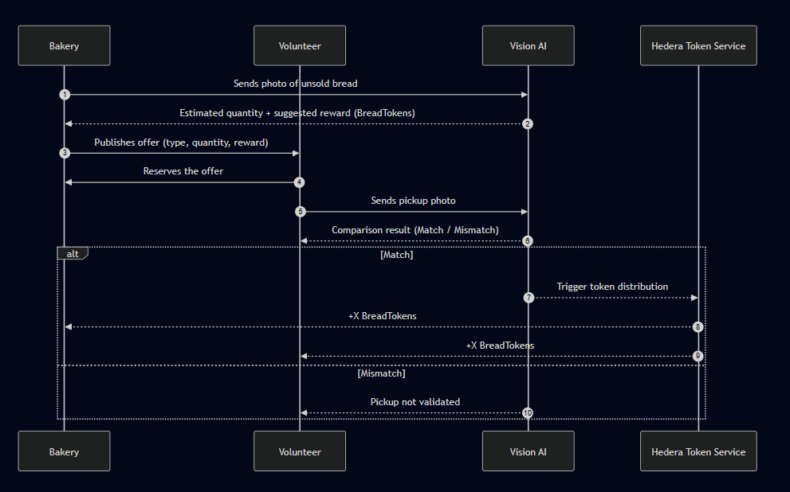

# 🥖 BreadRescue - Fight Bread Waste and Reward the Community

## 🌱 Introduction

**BreadRescue** is a decentralized platform designed to combat **bread waste** and promote **community engagement**.  
Every year in France, more than **150,000 tons of bread** are thrown away — the equivalent of **9 baguettes per person**.  
Meanwhile, many students, families, and volunteers are ready to **rescue** this perfectly edible bread.

BreadRescue connects **bakeries** with **local volunteers** who collect leftover bread and receive rewards in the form of **BreadTokens (BT)**.

---

## 🎯 Objectives

- ♻️ Reduce food waste, starting with bakeries.  
- 🤝 Encourage community action and social solidarity.  
- 🔗 Provide a **transparent and automated reward system** using the **Hedera Blockchain**.

---

## 📊 Key Statistics

- **150,000 tons of bread** wasted annually in France.  
- Equivalent to **10% of national production**.  
- BreadRescue transforms these losses into measurable, real-time impact.

> Source: *Too Good To Go – Boulangerie Study*

---

## 🪙 BreadTokens (BT) – The Reward System

| Element          | Description                                                                                                                   | Validation / Safeguards                                      |
| ---------------- | ----------------------------------------------------------------------------------------------------------------------------- | ------------------------------------------------------------ |
| **Base Reward**  | 5 BT for the bakery + 5 BT for the volunteer. Each BT = 1 kg of saved bread.                                                  | Transfer executed via Hedera Scheduled Transaction.          |
| **Traceability** | Every transaction is timestamped using **Hedera Consensus Service (HCS)** .                                      | Image-based AI verification prevents fraud.                  |

---

## ⚙️ How It Works

1. 🧁 **Bakery posts a bread offer** with a photo.  
2. 🧠 **AI model** estimates quantity and hashes the image for verification.  
3. 🙋‍♂️ **Volunteer claims the offer** and collects the bread.  
4. 📸 **Volunteer uploads a photo** at pickup.  
5. 🧠 **AI compares photos** to confirm pickup and validate reward.  
6. 🪙 **Tokens distributed** automatically via Hedera smart logic.

  

## 💡 Why BreadRescue?

- ✅ **Unforgeable Traceability** — timestamped events on Hedera.  
- 🤖 **Trustless Automation** — AI handles validation & rewards.  
- 🌍 **Eco-Social Impact** — promotes zero-waste and inclusion.  
- 🌐 **Open & Transparent** — all token actions are publicly verifiable.

---

## 🛠️ Tech Stack

- **Frontend**: React Typescript  
- **Backend**: Node.js + Express  
- **Blockchain**: Hedera Token Service (HTS) + Consensus Service (HCS)  
- **AI**: Computer Vision for image comparison  

---

## 🧪 Proof of Concept

We have implemented:

- AI-based photo matching system  
- Real-time reward system using Hedera HTS  
- Volunteer/bakery registration flow  
- Transaction traceability with HCS logs

